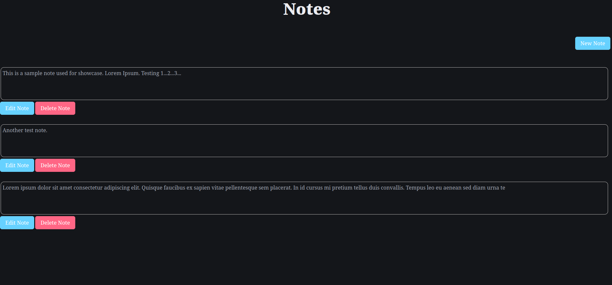
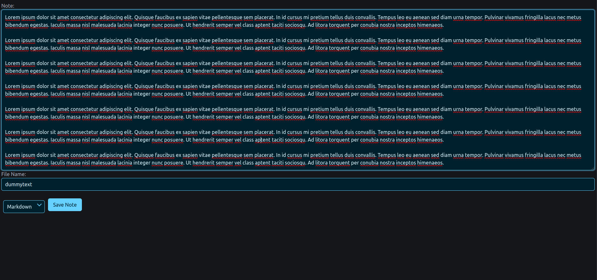
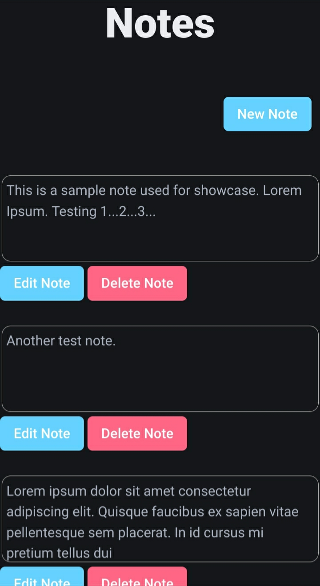
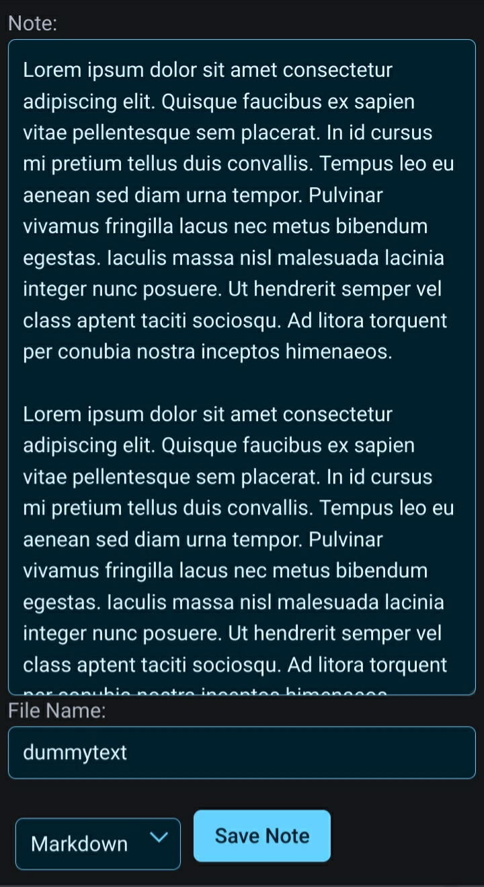

# Sample Notes App
A simple note-taking app made with Python/Flask and Bulma (CSS Library). <br>
**NOTE:** This is not intended for daily use but is a demonstration. You can fork and improve this if you want. You decide. <br>
Sorry if the frontend sucks on desktop. This was mostly made on my iPhone (I like making frontends on my phones for some reason). Most of the backend and refactoring was done on laptop. Again, I repeat, this is NOT for serious use case. Don't depend on this program for your notes. There are far many better note-taking apps out there such as Joplin and Obsidian with plugins. <br>
## How to run
On UNIX:
```
cd <project directory>
python3 app.py
```
Make **sure** to visit http://127.0.0.1:5000/index and **not** http://127.0.0.1:5000.
## Screenshots
### On Desktop


### On Mobile


